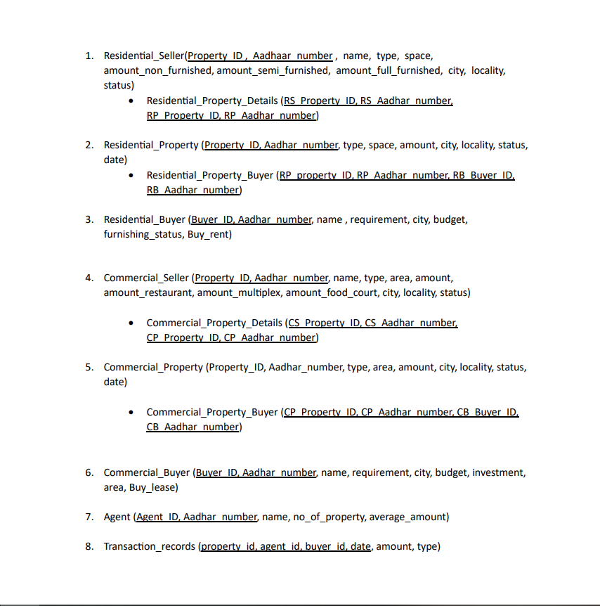

# **Real Estate**


## **Project Description**
This project involves developing a **Database Management System (DBMS)** for a real estate office that handles the sale and rental of houses and apartments within a city. The system will store data for agents, property details, and handle various queries to assist the real estate office in its operations.


## **Data Requirements**
The system must manage the following data:
- **Agents**: Agents facilitate **interactions with buyers and sellers, showcase properties, and handle sales or rental agreements**.
- **Properties**: The model should provide
  - Buy/Rent
  - Category(Type of property)
  - Property size (e.g., 1500 sq. ft)
  - Location
  - Furnishing Status

## **Data Generation**
You can refer to real estate websites such as [MagicBricks](https://www.magicbricks.com), [99Acres](https://www.99acres.com), and [Makaan](https://www.makaan.com) for inspiration on data generation.

## **Project Requirements**

### **1. E-R Model**
- Construct an **E-R Diagram** representing the conceptual design of the database.
- Identify **primary keys**, **relationship cardinalities**, and any assumptions.
  
### **2. Relational Model**
- Convert the E-R design into a **relational model** and refine it according to relational design principles.
- **Create the relations** in MySQL.
- Create **indices** and **constraints** as needed.
- Refine both the E-R and relational models as necessary to ensure consistency.

### **3. Populating Relations**
- Populate the relations with enough **data** to make the queries meaningful and non-trivial.
- You may write a program to generate the test data.

### **4. Queries**
You are required to implement the following queries:
- List houses in your city (e.g., Guwahati) built after 2020 that are available for rent.
- Find addresses of houses in your city costing between Rs. 30,00,000 and Rs. 50,00,000.
- Find addresses of rental houses on a specific road (e.g., G.S. Road) with at least 2 bedrooms and a rent below Rs. 15,000 per month.
- Find the agent who sold the most properties by total amount in rupees in the year 2023.
- For each agent, calculate the **average selling price** of properties sold in 2018 and the **average time** properties remained on the market.
- List the details of the **most expensive houses** and those with the **highest rent** in the database.

### **5. Interfaces**
The database will be accessed by three types of users, each with their own interface:
- **Database Administrator**: Can access the system using SQL via the command line.
- **Real Estate Office**: A GUI interface to:
  - Get sales reports for each agent, including sale dates, property details, and selling prices.
  - View rental reports for each agent, including rent amount, area, and rental dates.
- **Agents**: Can update the database when a property is rented or sold. This can be implemented using:
  - Web applications
  - Standalone JavaScript applications.


## **E-R Diagram(Entity Relationship)**
An ER diagram shows the **relationship among entity sets**. An entity set is a group of similar
entities and these entities can have attributes. In terms of **DBMS**, an **entity is a table** or attribute
of a table in database, *so by showing relationship among tables and their attributes*, ER diagram
shows the complete logical structure of a database.


**Know more about the ER-Diagram [here](https://www.du.ac.in/du/uploads/departments/Operational%20Research/24042020_E-R%20Model.pdf).**

## **Schemas**

**To see the detailed schema see [schemas.md](schemas.md)**

## **Tools and Technologies**

### Frontend
- HTML
- CSS (including Bootstrap)
- JavaScript

### Backend
- Node.js
- MySQL

## **Prerequisites**

Before you can install and run this software, you must have the following prerequisites installed:

- **Node.js (version 14 or later)**
- **npm (version 6 or later)**
- **MySQL (version 8 or later)**
- **MySQL Workbench (latest version)**

If you don't have Node.js or npm installed, you can download and install them from the [Node.js website](https://nodejs.org/en/). If you don't have MySQL or MySQL Workbench installed, you can download and install them from the [MySQL website](https://dev.mysql.com/downloads/). 

Make sure to install the latest versions of *Node.js, npm, MySQL, and MySQL Workbench* to ensure compatibility with this software.

To import the provided database, follow these steps:

- Extract the **database** file present in the root directory.
- Open MySQL Workbench and connect to your MySQL database.
- Click on **```Server > Data Import```**.
- Select **```Import from Self-Contained File```** and browse to the location of the extracted database file.
- Under **```Default Schema to be Imported To```**, select **```New...```** and enter the name **"project"** for the database.
- Click **```Start Import```** to import the database.

## **Installation**

- **Clone the repository or download the source code**
```
git clone https://github.com/Parshantkumar2033/Real_estate_website.git
```

- **Install dependencies by running the following command in the project directory**
```
npm install`
```

## **Configuration**

Create a **```.env```** similar to the **```.env.example```** file in the root directory and make the following changes to it:
- Replace **`Your mysql username`** with with the username of your mysql local server (usually **"root"**).
- Replace **`Your mysql password`** with with the password of your mysql local server.

## **Starting the app**

- Run the following command in the project directory:
```
nodemon .\app.js` or `node .\app.js
```
